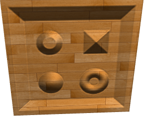
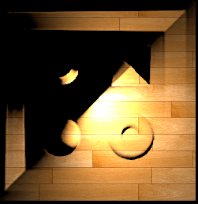
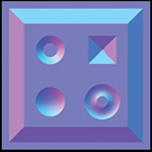
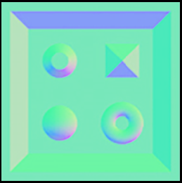
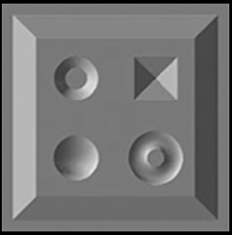
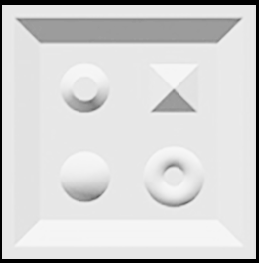
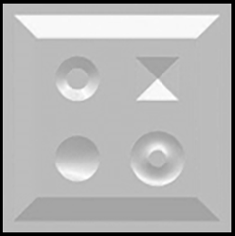
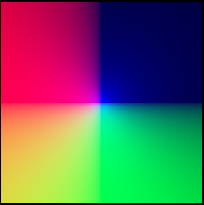
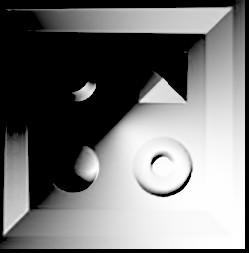
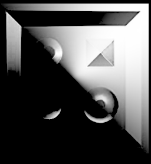

# Orthographic forward lighting with point lights & normal maps
This wgpu (WebGPU) rust project attempts to draw a single sprite and point light within an orthographic perspective.  Unfortunately when introducing normal maps, weird lighting behavior occurs.

<table>
    <tr>
        <td>
            <p>Expected</p>
            
            <p><i>(lit with directional light and perspective view but you can imagine point/orthgraphic)</i></p>
        </td>
        <td>
            <p>Actual</p>
            
        </td>
    </tr>
</table>

The lighting is exceedingly strong in SE direction and dark in the NW.  It first presents itself in the fragment shader when looking at the dot product of normal/direction:
```
let max_dot = max(dot(normal, direction), 0.0);
```

These are some debug images that came out of the fragment shader:
<table>
    <tr>
        <td>
            <p>Original normals without reversing y-direction, <br> normalizing or splitting range from -1 to 1</p>
            
        </td>
        <td>
            <p>Normals after flipping y</p>
            
        </td>
    </tr>
</table>

I flip y because I believe this particular normal map was not made for a right-handed coordinate system.  Even if I'm wrong, I tried retaining the original direction as well.  No significant difference.

These are the individual normal channels:
<table>
    <tr>
        <td>
            <p>X</p>
            
        </td>
        <td>
            <p>Y</p>
            
        </td>
        <td>
            <p>Z</p>
            
        </td>
    </tr>
</table>

This is the direction vector between the point light and fragments



These are the dot product images where the problem first shows up:
<table>
    <tr>
        <td>
            <p>max(dot(normal, direction), 0.0)</p>
            
        </td>
        <td>
            <p>max(dot(normal, direction), 0.0) with original y</p>
            
        </td>
    </tr>
</table>

## Conclusion
My hunch is that either the light and fragment direction vector is mangled between mixed coordinate systems or I'm using the wrong texture format.  I've tried a few.